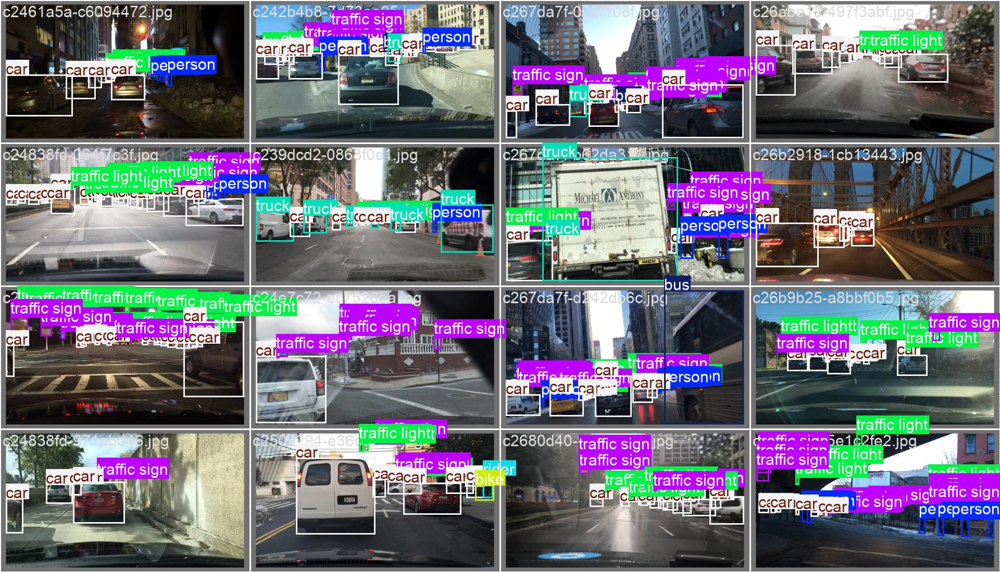

# Object_Detection

The project consists of python scripts to train a yolo object detection model from the  [BDD100K dataset](https://bair.berkeley.edu/blog/2018/05/30/bdd/).
The python packages are listed in the requirements.txt file. Install the packages in a dedicated virtual environment.
Training and inference scripts are provided for their respective purposes. Parameters.json file controls the path to the train, test and validation folders. 

The original dataset contains the labels in json format. The data_preparation script loads the json and automatically converts to a format readable from ultralytics yolo model. It essentially organises the data into separate label text files for each image and the contents as <class_id> <center_x> <center_y> <width> <height>

Additionally, the trained model is uploaded as a docker image which can be inferred from the inference_docker.py. Provide path to the inference images in the parameters.json. The images are expected to be 3 channel [0-255] gray values.

## To build the docker image locally: 

The image is uploaded in the link: 
[Docker Image Link](https://hub.docker.com/r/vivekasharmah/object_detection_yolo)

### Steps to run the image:
1) Pull the image using cmd :
<u>docker pull vivekasharmah/object_detection_yolo:v1.0.0</u>

2) Run: <u>docker run -p 8000:8000 vivekasharmah/object_detection_yolo:v1.0.0</u>

3) Execute inference from inference_docker.py
